  
  

    
    
    
    

    
    
    <h1>
        howdy!
        
    </h1>
    
I'm a musician, developer, network lover, and avid reader. I enjoy looking at the stars, learning new things, and reading and watching sci-fi movies and TV shows. Some of my interests include computers, physics, philosophy, and music.

  
<b>⚡ My Github Stats ...</b>
 
  

  
  

